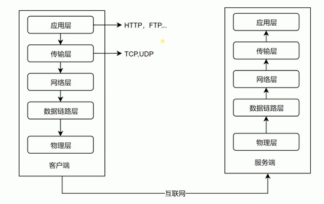
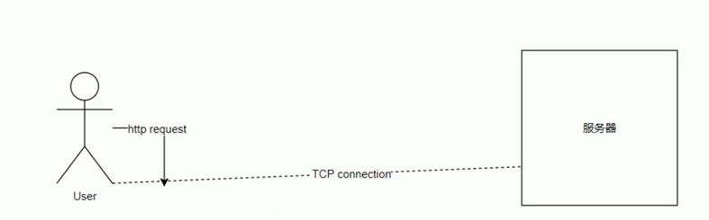
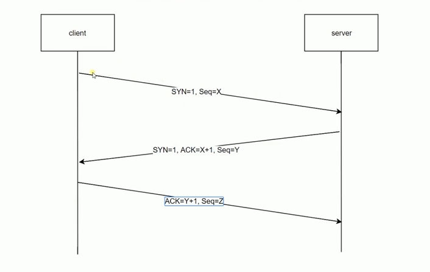
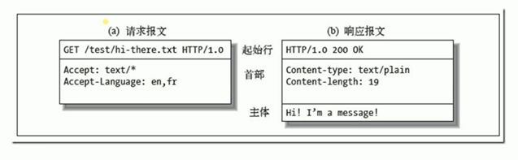

# HTTP协议基础及发展历史


## 5层网络模型介绍




底三层
- 物理层：主要作用是定义物理设备如何传输数据
- 数据链路层：在通信的实体间建立数据链路连接
- 网络层：为数据在结点之间传输创建逻辑链路


传输层
- 向用户提供可靠的端到端(End-to-End)服务
- 传输层向高层屏蔽了下层数据通信的细节

应用层
- 为应用软件提供了很多服务
- 构建于TCP协议之上
- 屏蔽网络传输相关细节


## HTTP协议发展历史


HTTP/0.9
- 只有一个命令GET
- 没有HEADER等描述数据的信息
- 服务器发送完毕，就关闭TCP连接

HTTP/1.0
- 增加了许多命令
- 增加了status code和header
- 增加了多字符集支持、多部分发送、权限、缓存等

HTTP/1.1
- 持久连接
- pipeline
- 增加了host和其他一些命令


HTTP2
- 所有数据以二进制传输
- 同一个连接里面发送多个请求不再需要按照顺序来
- 头信息压缩以及推送等提高效率的功能


## HTTP三次握手





三次握手时序图




## URI-URL和URN

URI
- URI： Uniform Resource Identifier，统一资源标识符
- 用来唯一标识互联网上的信息资源
- 包括URL、URN

URL
- URL：Uniform Resource Locator，统一资源定位符
- http://user/pass@host.com:80/path?query=string#hash


模式/协议（scheme）：它告诉浏览器如何处理将要打开的文件。最常用的模式是超文本传输协议（Hypertext Transfer Protocol，缩写为HTTP），这个协议可以用来访问网络。 其他协议如下：
- http——超文本传输协议资源
- https——用安全套接字层传送的超文本传输协议
- ftp——文件传输协议
- mailto——电子邮件地址
- ldap——轻型目录访问协议搜索
- file——当地电脑或网上分享的文件
- news——Usenet新闻组
- gopher——Gopher协议
- telnet——Telnet协议


URN
- 永久统一资源定位符：Uniform Resource Name
- 在资源移动之后还能被找到
- 目前还没有非常成熟的使用方案


## HTTP报文格式




HTTP方法
- 用来定义对于资源的操作
- 常用GET、POST等
- 从定义上讲有各自的语义

HTTP code
- 定义服务器对请求的处理结果
- 各个区间的code有各个的语义
- 好的HTTP服务可以通过code判断结果


## nodejs创建一个服务

```js
const http = require('http');

http.createServer(function (request, response) {
    console.log('request come', request.url);

    response.end('123');
}).listen(8888)

console.log('server listening on 8888');
```

