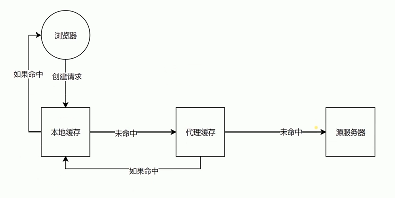

# HTTP各种特性总览

## 认识HTTP客户端

- 浏览器
- curl


## CORS跨域请求的限制与解决

跨域

server1
```js
const http = require('http')
const fs = require('fs')

http.createServer(function (request, response) {
  console.log('request come', request.url)

  const html = fs.readFileSync('test.html', 'utf8')
  response.writeHead(200, {
    'Content-Type': 'text/html'
  })
  response.end(html)
}).listen(8888)

console.log('server listening on 8888')

```

server2
```js
const http = require('http')

http.createServer(function (request, response) {
  console.log('request come', request.url)

  response.writeHead(200, {
    'Access-Control-Allow-Origin': 'http://127.0.0.1:8888'
  })
  response.end('123')
}).listen(8887)

console.log('server listening on 8887')
```

html
```html
<!DOCTYPE html>
<html lang="en">
<head>
  <meta charset="UTF-8">
  <meta name="viewport" content="width=device-width, initial-scale=1.0">
  <meta http-equiv="X-UA-Compatible" content="ie=edge">
  <title>Document</title>
</head>
<body>
    
</body>
<!-- <script>
  var xhr = new XMLHttpRequest()
  xhr.open('GET', 'http://127.0.0.1:8887/')
  xhr.send()
</script> -->

<!-- jsonp -->
<script scr="http://127.0.0.1:8887/'"></script>

</html>
```


## CORS跨域限制以及预请求验证

CORS预请求验证

允许的方法：GET、HEAD、POST

允许的Content-type
- text/plain
- multipart/form-data
- application/x-www-form-urlencoded

其他限制
- 请求头的限制
- XMLHttpRequestUpload对象均没有注册任何事件监听器
- 请求中，没有ReadableStream


```js
response.writeHead(200, {
    'Access-Control-Allow-Origin': 'http://127.0.0.1:8888',
    'Access-Control-Allow-Headers': 'X-Test-Cors',
    'Access-Control-Allow-Methods': 'POST, PUT, DELETE',
    'Access-Control-Max-Age': '1000'
});
```

```html
html
```html
<!DOCTYPE html>
<html lang="en">
<head>
  <meta charset="UTF-8">
  <meta name="viewport" content="width=device-width, initial-scale=1.0">
  <meta http-equiv="X-UA-Compatible" content="ie=edge">
  <title>Document</title>
</head>
<body>
    
</body>
<!-- cors1 -->
<!-- <script>
  var xhr = new XMLHttpRequest()
  xhr.open('GET', 'http://127.0.0.1:8887/')
  xhr.send()
</script> -->

<script>
  fetch('http://localhost:8887', {
    method: 'POST',
    headers: {
      'X-Test-Cors': '123'
    }
  })
</script>
</html>
```


## 缓存头Cache-Control的含义和使用


可缓存性
- public：任何地址都可以缓存
- private：只有发起请求
- no-cache：验证过后可缓存

到期
- `max-age=<seconds>`
- `s-maxage=<seconds>`
- `max-stale=<seconds>`

重新验证
- must-revalidate
- proxy-revalidate

其他
- no-store：不可缓存
- no-transform：不可更改内容


```js
response.writeHead(200, {
    'Content-Type': 'text/javascript',
    'Cache-Control': 'max-age=20'
})
```


## 缓存验证Last-Modified和Etag的使用




验证头
- Last-Modified
- Etag

Last-Modified
- 上次修改时间
- 配合If-Modifed-Since 或者 If-Nnmodifed-Since使用
- 对比上次修改时间验证资源是否需要更新


Etag
- 数据签名
- 配合 If-Match 或 If-Non-Match 使用
- 对比资源签名验证资源是否需要更新

```js
const etag = request.headers['if-none-match']
if (etag === '777') {
    response.writeHead(304, {
    'Content-Type': 'text/javascript',
    'Cache-Control': 'max-age=2000000, no-cache',
    'Last-Modified': '123',
    'Etag': '777'
    })
    response.end()
} else {
    response.writeHead(200, {
    'Content-Type': 'text/javascript',
    'Cache-Control': 'max-age=2000000, no-cache',
    'Last-Modified': '123',
    'Etag': '777'
    })
    response.end('console.log("script loaded twice")')
}
```


## cookie和session

cookie
- 通过Set-Cookie设置
- 下次请求自动带上
- 键值对，可以设置多个


cookie属性
- max-age \ expires设置过期时间
- Secure只在https的时候发送
- HttpOnly无法通过document.cookie访问

```js
response.writeHead(200, {
    'Content-Type': 'text/html',
    'Set-Cookie': ['id=123; max-age=2', 'abc=456;domain=test.com']
})
```


## HTTP长连接

限制6个

Connection ID


## 数据协商

分类
- 请求
- 返回


Accecpt
- Accecpt
- Accecpt-Encoding
- Accecpt-Language
- User-Agent

Content
- Content-Type
- Content-Encoding
- Content-Language


## Redirect

```js
response.writeHead(302, {  // or 301
    'Location': '/new'
})
```


##  CSP

CSP全称Content Security Policy ,可以直接翻译为内容安全策略


作用
- 限制资源获取
- 报告资源获取越权


限制方式
- default-src限制全局
- 限制资源类型


资源类型
- script-src：外部脚本
- style-src：样式表
- img-src：图像
- media-src：媒体文件（音频和视频）
- font-src：字体文件
- object-src：插件（比如 Flash）
- child-src：框架
- frame-ancestors：嵌入的外部资源（比如`<frame>、<iframe>、<embed>和<applet>`）
- connect-src：HTTP 连接（通过 XHR、WebSockets、EventSource等）
- worker-src：worker脚本
- manifest-src：manifest 文件


```js
response.writeHead(200, {
    'Content-Type': 'text/html',
    'Content-Security-Policy': 'script-src \'self\'; form-action \'self\'; report-uri /report'
})
```


```html
<meta http-equiv="Content-Security-Policy" content="script-src 'self'; object-src 'none'; style-src cdn.example.org third-party.org; child-src https:">
```


链接: https://developer.mozilla.org/zh-CN/docs/Web/Security/CSP

