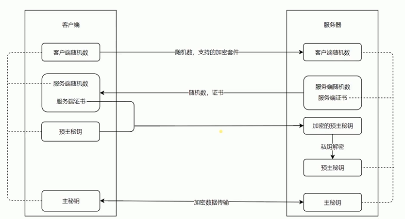
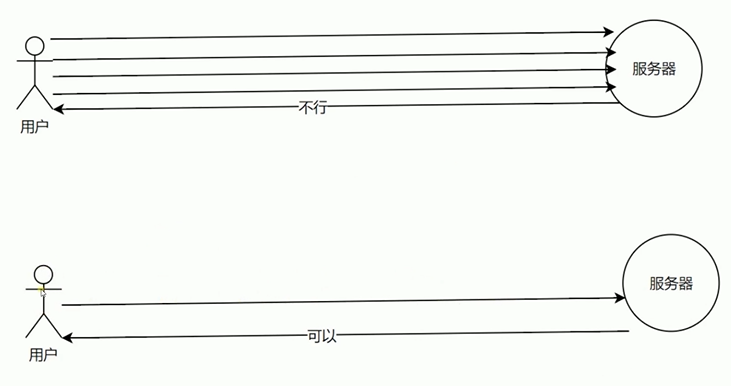

# Nginx

- Nginx安装和基础代理配置
- Nginx代理配置和代理缓存的用处
- HTTPS解析
- 使用Nginx部署HTTPS服务
- HTTP2的优势和Nginx配置HTTP2的简单使用


```
proxy_cache_path cache levels=1:2 keys_zone=my_cache:10m;

server {
  listen       80;
  server_name  test.com;

  location / {
    proxy_cache my_cache;
    proxy_pass http://127.0.0.1:8888;
    proxy_set_header Host $host;
  }
}


server {
  listen        80 default_server;
  listen       [::]:80 default_server;
  server_name  test.com;
  return 302 https://$server_name$request_uri;
}

server {
  listen       443 http2;
  server_name  test.com;

  http2_push_preload  on;

  ssl on;
  ssl_certificate_key  ../certs/localhost-privkey.pem;
  ssl_certificate      ../certs/localhost-cert.pem;

  location / {
    proxy_cache my_cache;
    proxy_pass http://127.0.0.1:8888;
    proxy_set_header Host $host;
  }
}
```


HTTPS

加密
- 私钥
- 公钥




优势
- 信道复用
- 分帧传输
- Server Push





ALPN


