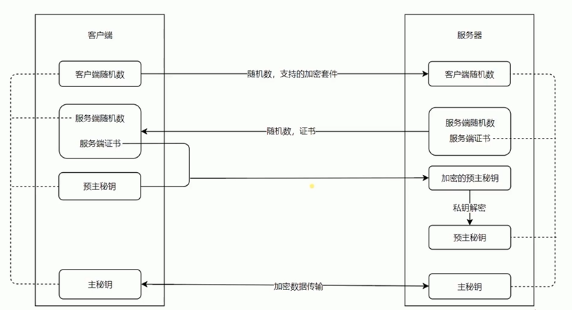

# Nginx 代理以及面向未来的 HTTP

- Nginx 安装和基础代理配置
- Nginx 代理配置和代理缓存的用处
- HTTPS 解析
- 使用 Nginx 部署 HTTPS 服务
- HTTP2 的优势和 Nginx 配置 HTTP2 的简单使用

```js
proxy_cache_path cache levels=1:2 keys_zone=my_cache:10m;

server {
  listen       80;
  server_name  test.com;

  location / {
    proxy_cache my_cache;
    proxy_pass http://127.0.0.1:8888;
    proxy_set_header Host $host;
  }
}


server {
  listen        80 default_server;
  listen       [::]:80 default_server;
  server_name  test.com;
  return 302 https://$server_name$request_uri;
}

server {
  listen       443 http2;
  server_name  test.com;

  http2_push_preload  on;

  ssl on;
  ssl_certificate_key  ../certs/localhost-privkey.pem;
  ssl_certificate      ../certs/localhost-cert.pem;

  location / {
    proxy_cache my_cache;
    proxy_pass http://127.0.0.1:8888;
    proxy_set_header Host $host;
  }
}
```

## HTTPS

加密
- 私钥
- 公钥



优势
- 信道复用
- 分帧传输
- Server Push


## ALPN

ALPN (Application Layer Protocol Negotiation)是TLS 的扩展，允许在安全连接的基础上进行应用层协议的协商。ALPN支 持任意应用层协议的协商，目前应用最多是HTTP2的协商。在2016年，ALPN 已经完全替代 NPN 了。

ALPN 实现

1. 实现一：Jetty

Jetty 以独立 JAR 包形式提供了 ALPN 实现，但是需要依赖 OpenJDK 7 或者 OpenJDK 8

2. 实现二：OpenSSL

需要将版本升级到1.0.2 以上
