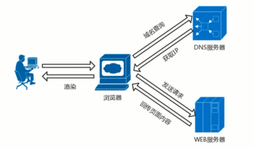
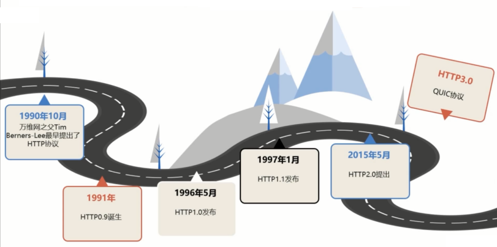
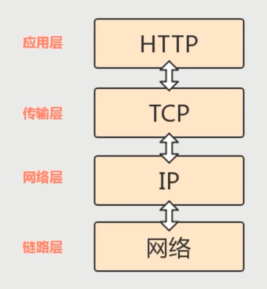
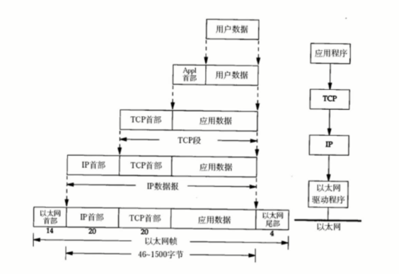
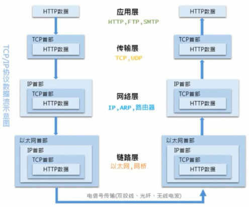
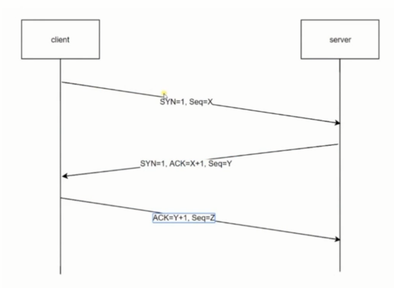
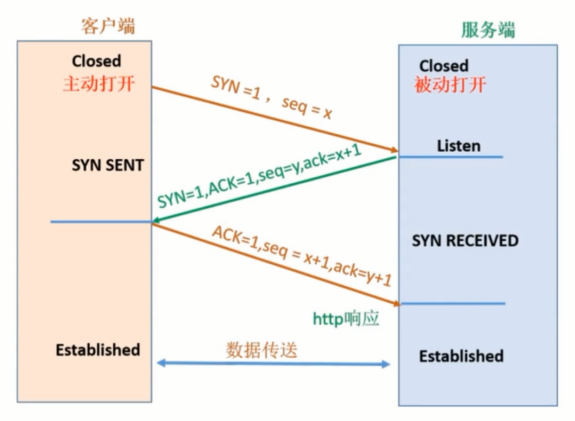
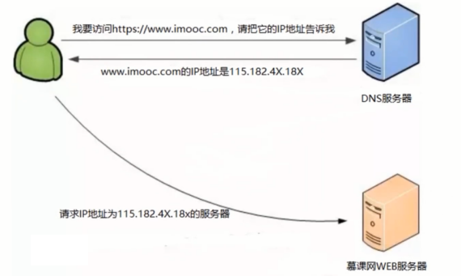
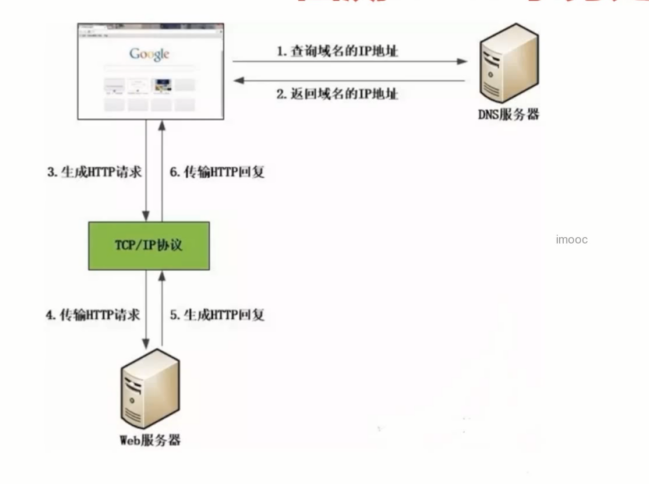
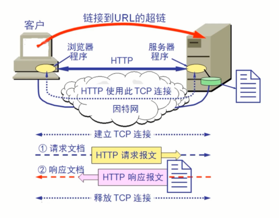

# HTTP 初相识 - 了解 HTTP 协议

## 浏览器背后的故事

HTTP:
- 超文本传输协议(HTTP) 是一种`通信协议`, 它允许将超文本标记语言(HTML) 文档从 WEB 服务器传送到客户端的浏览器
- HTTP 是一个属于`应用层的面向对象的协议`, 由于其简捷、快速的方式，适用于分布式超媒体信息系统。它于 1990 年提出，经过几年的使用与发展，得到不断地完善和扩展

Web 与 HTTP：
- WEB 是一种基于超文本和 HTTP 的、全球性的、动态交互的、跨平台的分布式`图形信息系统`。
- 建立在 Internet 上的网络服务，为浏览者在 Internet 上查找和浏览信息提供了图形化的、易于访问的直观界面，其中的文档及超级链接将 Internet 上的信息节点组织成一个互为关联的网状结构。

## HTTP 协议的前世今生

## 透过 TCPIP 看 HTTP

HTTP 协议是构建在 TCP/IP 协议之上的，是 TCP/IP 协议的一个子集。

TCP/IP 协议族：
- TCP/IP 协议其实是一系列与互联网相关联的协议集合起来的总称
- 分层管理是 TCP/IP 协议的重要特征

TCP/IP 协议族分层：
- 是由四层协议组成的系统，这四层分别是：应用层、传输层、网络层和数据链路层。

- 应用层：
    - 应用层一般是我们编写的应用程序，决定了向用户提供的应用服务。应用层可以通过系统调用与传输层进行通信。
    - 如： FTP、DNS、HTTP 等。
- 传输层:
    - 传输层通过系统调用向应用层提供处于网络连接中的两台计算机直接的数据传输功能。
    - 在传输层有两个性质不同的协议： TCP 和 UDP。
- 网络层:
    - 网络层用来处理在网络上流动的数据包，数据包是网络传输的最小数据单位。该层规定了通过怎样的路径(传输路线)到达对方计算机，并把数据包传输给对方。
- 数据链路层:
    - 链路层用来处理连接网络的硬件部分，包括控制操作系统、硬件设备驱动、NIC(Network Interface Card, 网络适配器) 以及光纤等物理可见部分。硬件上的范畴均在链路层的作用范围之内。

数据包的封装过程：

HTTP 数据传输过程：
- 发送端发送数据时，数据会从上层传输到下层，且每经过一层都会被打上盖层的头部信息。而接受端接收数据时，数据会从下层传输到上层，传输前会把下层的头部信息删除。

传输层 - TCP 三次握手
- 传输层 TCP 协议进行通信的双方必须先建立连接，然后才能开始传输数据。为了确保连接双方可靠性，在双方建立连接时，TCP 协议采用了三次握手策略。

- 第一次握手：客户端发送带有 SYN 标志的连接请求报文段，然后进入 SYN_SEND 状态，等待服务器的确认。
- 第二次握手：服务端接收到客户端的 SYN 报文段后，需要发送 ACK 信息对这个 SYN 报文段进行确认。同时，还要发送自己的 SYN 请求信息。服务端会将上述的信息放到一个报文段(SYN + ACK 报文段) 中，一并发送给客户端，此时服务端将会进入 SYN_RECV 状态。
- 第三次握手：客户端接收到服务器端的 SYN + ACK 报文段后，会想服务器发送的 ACK 确认报文段，这个报文段发送完毕后，客户端和服务端都进入 ESTABLISHED 状态，完成 TCP 三次握手。

## "你是如何访问 www.xxx.com 的" - DNS 域名解析

通常我们访问一个网站，使用的是主机名或者域名来进行访问的。因为相对于 IP 地址(一组纯数字), 域名更容易让人记住。但 TCP/IP 协议使用的是 IP 地址进行访问的，所以必须有个机制或者服务把域名转换成 IP 地址。 DNS 服务就是用来解决这个问题的，它提供域名到 IP 地址之间的解析服务.

## 回溯 HTTP 事务处理过程

当客户端访问 WEB 站点时，首先会通过 DNS 服务器查询到域名的 IP 地址。然后浏览器生成 HTTP 请求，并通过 TCP/IP 协议发送给 WEB 服务器。 WEB 服务器接收到请求后会根据请求生成响应内容，并通过 TCP/IP 协议返回给客户端。

## 实验：与 HTTP 请求的第一次亲密接触

[Wireshark](https://www.wireshark.org/)（前称 Ethereal）是一个网络封包分析软件。网络封包分析软件的功能是撷取网络封包，并尽可能显示出最为详细的网络封包资料。Wireshark 使用 WinPCAP 作为接口，直接与网卡进行数据报文交换。
