# HTTP 再邂逅 - 熟悉 HTTP 协议结构和通讯原理

## HTTP 协议特点

1. 支持客户/服务器模式
    - 支持客户/服务器模式工作的方式是由客户端向服务器发出请求，服务器端响应请求，并进行响应服务.

        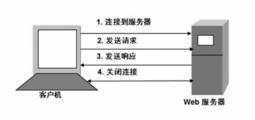

2. 简单快捷
    - 客户向服务器请求服务时，只需要传送请求方法和路径
    - 请求方法常用的有 GET、HEAD、POST 等。每种方法规定了客户和服务器联系的类型不同。
    - 由于 HTTP 协议简单，使得 HTTP 服务器的程序规模小，因而通信速度很快。

3. 灵活
    - HTTP 允许传输任意类型的数据对象
    - 正在传输的类型由 Content-Type (Content-Type 是 HTTP 包中用来表示内容类型的标识) 加以标记

4. 无连接
    - 无连接的含义是限制每次连接只处理一个请求
    - 服务器处理完客户的请求，并收到客户的应答后，即端断开连接。
    - 采用这种方式可以节省传输时间

5. 无状态
    - HTTP 协议是无状态协议
    - 无状态是指协议对于事务处理没有记忆能力。缺少状态意味着如果后续处理需要前面的信息，则它必须重传，这样可能导致每次连接传送的数据量增大
    - 另一方面，在服务器不需要先前信息时它的应答就较快

## 详解 URL 、URI 与 URN 的区别与联系

### 迷之兄弟 - URI 与 UTL

Q: 我们输入在浏览器里的 WEB 地址应该叫 URL 还是 URI?

- URI = Universal Resource Identifier 统一资源标志符，用来标识抽象或物理资源的一个紧凑字符串。
- URL = Universal Resource Locator 统一资源定位符，一种定位资源的主要访问机制的字符串，一个标准的 URL 必须包括：protocol、host、port、path、parameter、anchor。
- URN = Universal Resource Name 统一资源名称，通过特定命名空间中的唯一名称或 ID 来标识资源。

    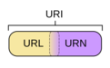

- URI 可以分为 UTL，URN 或者同时具备 Locators 和 names 特性的一个东西。
- URN 作用就好像一个人的名字，URL 就像一个人的地址。
- 换句话说：URN 确定了东西的身份，URL 提供了找到它的方式。
- URL 是 URI 的一种，但不是所有的 URI 都是 URL
- URL 和 URL 最大的差别是 "访问机制"
- URN 是唯一标识的一部分，是身份信息

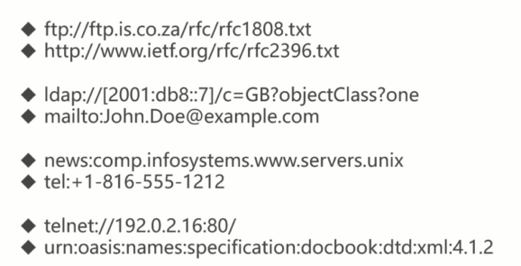

## HTTP 报文结构分析

### 请求报文

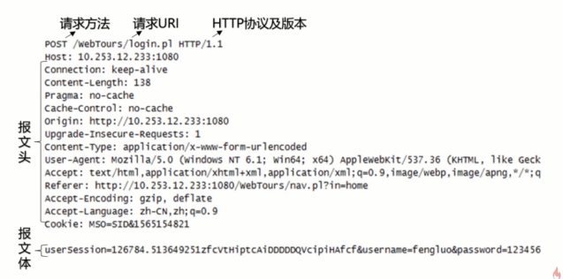

### HTTP 报文头

HTTP 的报文头大体可以分为四类，分别是：
1. 通用报文头
1. 请求报文头
1. 响应报文头
1. 实体报文头

在 HTTP/1.1 里规范了 47 种报文头字段
- 通用报文头
    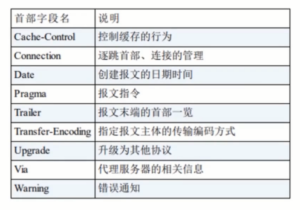
- 请求报文头
    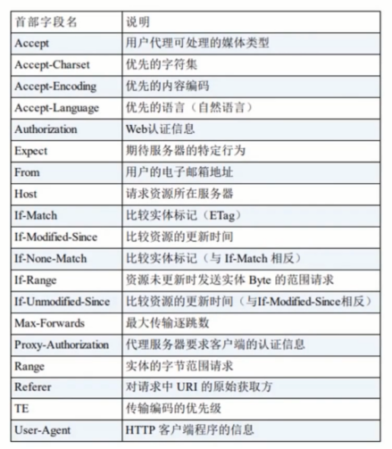
- 响应报文头
    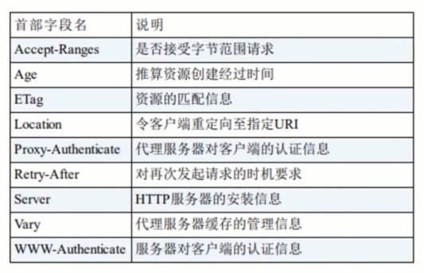
- 实体报文头
    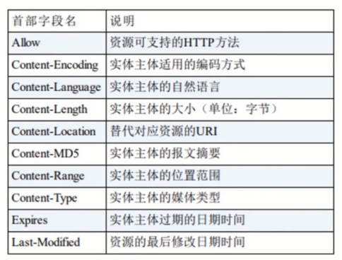

#### ACCEPT

- 作用：浏览器端可以接受的媒体类型
- ACCEPT: text/html 代表浏览器可以接受服务器会发的类型为 text/html 也就是我们常说的 html 文档，如果服务器无法返回 text/html 类型的数据，服务器应该返回一个 406 错误(Non Acceptable)
- ACCEPT: */* 代表浏览器可以处理所有类型
- q= (q因子权重)：值代表优先顺序，用相对质量价值表示，又称作权重。
- 如果想给显示的媒体类型增加优先级，则使用 q= 来额外表示权重值；重值 q 的范围是 0-1 (可精确到小数点后3位)，且 1 为最大值。不指定权重 q 值时，默认权重为 q=1.0。 当的服务器提供多种内容时，将会首先返回权重值最高的媒体类型。

#### Accept-Encoding

Accept-Encoding，HTTP Header 中 Accept-Encoding 是浏览器发给服务器, 声明浏览器支持的编码类型

Accept-Encoding: compress, gzip // 支持 compress 和 gzip 类型

语法
```js
Accept-Encoding: gzip
Accept-Encoding: compress
Accept-Encoding: deflate
Accept-Encoding: br
Accept-Encoding: identity
Accept-Encoding: *

// Multiple algorithms, weighted with the quality value syntax:
Accept-Encoding: deflate, gzip;q=1.0, *;q=0.5
```

指令
- gzip 使用 Lempel-Ziv 编码（ LZ77 ）的压缩格式，带有32位 CRC 。
- compress 使用 Lempel-Ziv-Welch（ LZW ）算法的压缩格式。
- deflate 使用 zlib 结构的压缩格式，以及 deflate 压缩算法。
- br 使用 Brotli 算法的压缩格式。
- identity 指示身份功能（即不压缩，也不修改）。即使不存在，该值始终被认为是可以接受的。
- `*` 匹配尚未在标题中列出的任何内容编码。如果标题不存在，这是默认值。这并不意味着支持任何算法; 只是表示没有偏好。
- ;q=（ q 值加权）任何值都按照称为权重的相对质量值的优先顺序排列。

#### Accept-Language

作用：浏览器声明自己接受的语言

```js
Accept-Language: <language>
Accept-Language: <locale>
Accept-Language: *

// Multiple types, weighted with the quality value syntax:
Accept-Language: zh-cn, zh,; q=0.7, en-us; q=0.3
```

#### Connection

Connection: keep-alive 当一个网页打开完成后，客户端和服务器之间用于传输 HTTP 数据的 TCP 连接不会关闭，如果客户端再次访问这个服务器上的网页，会继续使用这一条已经建立的连接。持久连接是 HTTP / 1.1 请求的默认连接。

Connection: close 表示客户端或服务器想要关闭连接，当客户端再次发送 Request，需要重新建立 TCP 连接。这是 HTTP / 1.0 请求的默认值。

#### Host

作用：请求报头域注意用于指定被请求资源 Internet 主机和端口号，它通常从 HTTP URL 中提取出来的。

比如 https://www.baidu.com/ ，host 是 www.baidu.com

#### Referer

Referer 请求头中包含以前的 web 页面，从中当前请求页面的链接，随后的地址。例如，Referer 头允许服务器识别人们访问他们的位置，并且可以使用该数据进行分析，记录或优化缓存。

#### User-Agent

告诉 HTTP 服务器，客户端使用的操作系统和浏览器的名称和版本。

很多情况我们会通过 User-Agent 来判断浏览器类型，从而进行不同的兼容设计。

#### Content-Type

说明了报文体内对象的媒体类型。

- text/html ： HTML 格式
- text/plain ：纯文本格式
- text/xml ：  XML 格式
- image/gif ：gif 图片格式
- image/jpeg ：jpg 图片格式
- image/png：png 图片格式

以application开头的媒体格式类型：
- application/xhtml+xml ：XHTML 格式
- application/xml     ： XML 数据格式
- application/atom+xml  ：Atom XML 聚合格式
- application/json    ： JSON 数据格式
- application/pdf       ：pdf 格式
- application/msword  ： Word 文档格式
- application/octet-stream ： 二进制流数据（如常见的文件下载）
- application/x-www-form-urlencoded ： `<form encType="">`中默认的 encType，form 表单数据被编码为 key/value 格式发送到服务器（表单默认的提交数据的格式）

另外一种常见的媒体格式是上传文件之时使用的：
- multipart/form-data ： 需要在表单中进行文件上传时，就需要使用该格式

### 响应报文

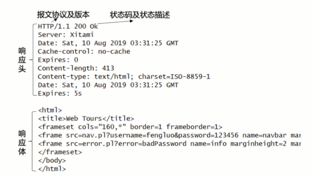

## HTTP 请求方法剖析

HTTP1.1 常用方法：

- GET：向指定的资源发出"显示"请求。使用 GET 方法应该只用在读取数据，而不应当被用于产生"副作用"的操作中，例如在 Web Application 中。其中一个原因是 GET 可能会被网络蜘蛛等随意访问。
- POST：向指定资源提交数据，请求服务器进行处理（例如提交表单或者上传文件）。数据被包含在请求本文中。这个请求可能会创建新的资源或修改现有资源，或二者皆有。
- PUT：向指定资源位置上传其最新内容。PUT 和 POST 方法最大的不同是： PUT 是幂等的，而 POST 是不幂等的。
- HEAD：与 GET 方法一样，都是向服务器发出指定资源的请求。只不过服务器将不传回资源的本文部分。它的好处在于，使用这个方法可以在不必传输全部内容的情况下，就可以获取其中"关于该资源的信息"（元信息或称元数据）。
- DELETE：请求服务器删除 Request-URI 所标识的资源。
- OPTIONS：这个方法可使服务器传回该资源所支持的所有 HTTP 请求方法。用'*'来代替资源名称，向Web服务器发送 OPTIONS 请求，可以测试服务器功能是否正常运作。
- TRACE：回显服务器收到的请求，主要用于测试或诊断。
- CONNECT：HTTP/1.1 协议中预留给能够将连接改为管道方式的代理服务器。通常用于 SSL 加密服务器的链接（经由非加密的 HTTP 代理服务器）。

## HTTP 响应状态码拆解

状态码
- 是用以表示网页服务器超文本传输协议响应状态的 3 位数字代码。


HTTP 状态码详解

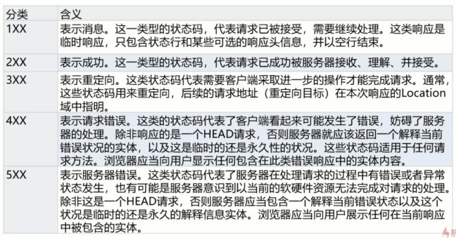

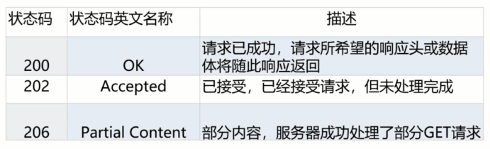

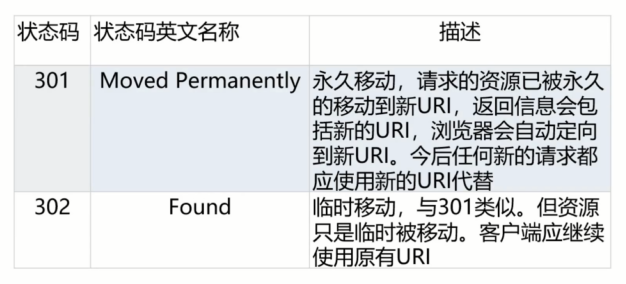

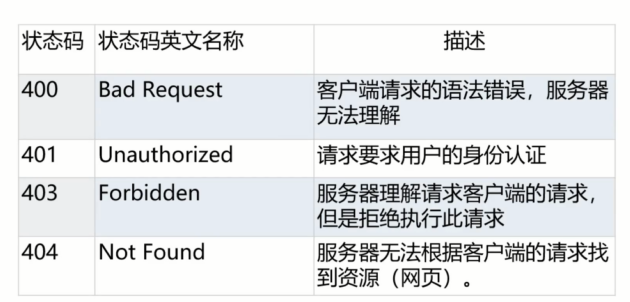

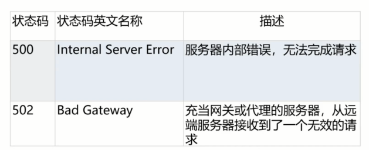

## 实验：用 telnet 分析 http 协议的通讯过程

```js
cmd--> telnet
set localecho
open 127.0.0.1 1080
```

## HTTP 状态管理：Cookie 与 Session

### Cookie

Cookie 实际上是一小段的文本信息。客户端请求服务器，如果服务器需要记录该东湖状态，就向客户端浏览器频发一个 Cookie。

客户端浏览器会把 Cookie 保存起来。当浏览器再请求该网站时，浏览器把请求的网站连同该 Cookie 一同提交给服务器。服务器检查该 Cookie，以次来辨认用户状态。

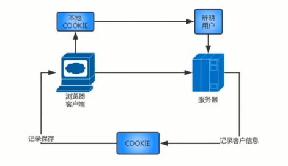

Cookie 工作原理：

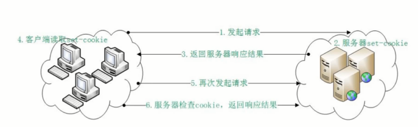

### Session

Session 是另一种记录客户状态的机制，保存在服务器上。客户端浏览器访问服务器的时候，服务器把客户端信息以某种形式记录在服务器上。

客户端浏览器再次访问时，只需要从该 Session 中查找该客户的状态就可以了。

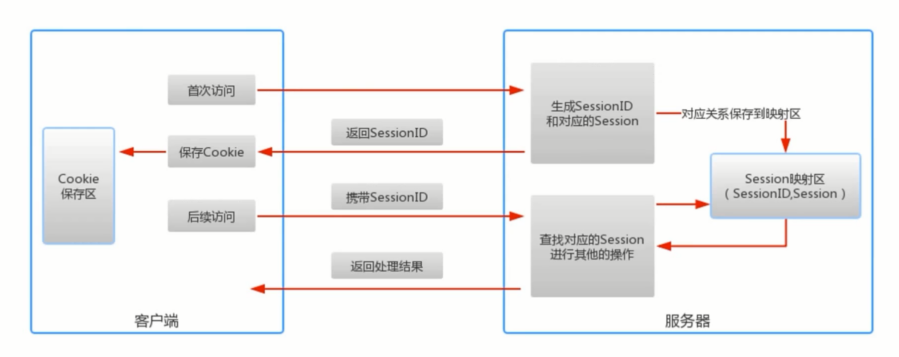

保存 Session ID 的方式：
- Cookie
- URL 重写
- 隐藏表单

Session 的有效期
- Session 超时失效
- 程序调用 HttpSesion.invalidate()
- 服务器进程被终止

### Cookie 与 Session

- 存在位置不同
- 安全性(隐藏策略)的不同
- 有效期上的不同
- 对服务器压力的不同

## 参考

- https://cloud.tencent.com/developer/section/1189880
- https://www.cnblogs.com/klb561/p/10090540.html
