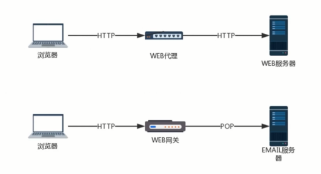

# HTTP 渐相知 - 深入认识 HTTP 协议不为人知的特性和使用方法

## 聊聊 HTTP 协议中的编码和解码

### 字符集与编码

1. 什么是编码？
2. 为什么要编码？
3. 什么时候会出现乱码？

- 计算机是如何显示文字的？


常见编码规范


`utf-8`: UTF-8（8 位元，Universal Character Set/Unicode Transformation Format）是针对 Unicode 的一种可变长度字符编码。它可以用来表示 Unicode 标准中的任何字符，而且其编码中的第一个字节仍与 ASCII 相容，使得原来处理 ASCII 字符的软件无须或只进行少部份修改后，便可继续使用。

URL的编码与解码
- URL 是采用 ASCII 字符集进行编码的，所有如果 URL 中含有非 ASCII 字符集中的字符，要对其进行编码。
- URL 中一些保留字符，如 & 表示参数分割符，如果想要在 URL 中使用这些保留字，那就需要编码。
- "%编码" 规范
- 对 URL 中属于 ASCII 字符集的非保留字不做编码；对 URL 中的保留字需要取其 ASCII 内码，然后加上 "%" 前缀将该字符进行编码；对应 URL 中的非 ASCII 字符需要取其 Unicode 内码，然后加上 "%" 前缀将该字符进行编码。

[Fiddler](https://www.telerik.com/fiddler)

## HTTP 协议之基本认证

身份认证信息：
- 密码
- 动态令牌
- 数字证书
- 生物认证
- IC 卡
- ...

常见认证方式：
- BASIC 认证(基本认证)
- DIGEST 认证(摘要认证)
- SSL 客户端认证
- FromBase 认证(基于表单认证)

### BASIC 认证

什么是 BASIC 认证？


### DIGEST 认证

什么是 DIGEST 认证？
- 为弥补 BASIC 认证存在的弱点，从 HTTP1.1 起就有了 DIGEST 认证
- DIGEST 认证同样使用质询 / 响应的方式，但不会像 BASIC 认证那样直接发送明文密码。


### SSL 客户端认证

SSL 客户端认证是借由 HTTPS 的客户端证书完成认证的方式。凭借客户端证书认证，服务器可确认访问是否来自己登录的客户端。

### 基于表单认证

- 基于表单认证方式并不是在 HTTP 协议中定义的。
- 使用由 Web 应用程序各自实现基于表单的认证方式。
- 通过 Cookie 和 Session 的方式来保持用户的状态。

## HTTP 中长连接与短连接

- HTTP 协议是基于请求/响应模式的，因此只要服务器给了响应，本次 HTTP 请求就结束了。
- HTTP 的长连接和短连接本质上是 TCP 长连接和短连接。

- HTTP 1.0 中，默认使用的是短连接。也就是说，浏览器和服务器每进行一次 HTTP 操作，就建立一次连接，结束就中断。
- HTTP 1.1 起，默认使用长连接，用来保持连接特征。

短连接：
- 建立连接 - 数据传输 - 关闭连接 ... 建立连接 - 数据传输 - 关闭连接

长连接：
- 建立连接 - 数据传输 ... （保持连接）... 数据传输 - 关闭连接

## HTTP 中介之代理


代理的作用：
- 抓包
- FQ
- 匿名访问
- 过滤器


## HTTP 中介之网关

网关可以作为某种翻译器使用，它抽象了一种能够到达资源的方法。网关是资源和应用程序之间的粘合剂。

网关扮演的是"协议转换器"的角色。



Web 网关在一侧使用 HTTP 协议，在另一侧使用另一种协议。
- `<客户端协议>/<服务端协议>`
- (HTTP/)服务器端网关：通过 HTTP 协议与客户端对话，通过其他协议与服务器通信。
- (/HTTP)客户端网关：通过其他协议与客户端对话，通过 HTTP 协议与服务器通信。

常见的网关类型：
- (HTTP/*) 服务器端 WEB 网关
- (HTTP/HTTPS) 服务器端安全网关
- (HTTPS/HTTP) 客户端安全加速器网关
- 资源网关

## HTTP 缓存

1. 为什么要使用 HTTP 缓存？
1. 缓存的内容是什么？

### HTTP 缓存头部字段

Cache-Control：请求响应头，缓存控制字段
- no-store：所有内容都不缓存。
- no-cache：缓存，但是浏览器使用缓存前，都会请求服务器判断缓存资源是否是最新的。
- max-age=x(单位秒)请求缓存后的x秒内不再发起请求。
- s-maxage=x(单位秒)代理服务器请求源站缓存后的x秒不再发起请求，只对 CDN 缓存有效。
- public：客户端和服务器代理(CDN)都可以缓存
- private: 只有客户端可以缓存。

Expires
- 代表资源过期时间，由服务器返回提供，是 http 1.0 的属性，在与 max-age 共存的情况下，优先级要低。

Last-Modified
- 资源最新修改时间，由服务器告诉浏览器

if-Modified-Since
- 资源最新修改时间，由服务器告诉浏览器，和 Last-Modified 是一对，它两会进行对比。

Etag
- 资源标识，由服务器告诉浏览器

if-None-Match
- 缓存资源标识，由浏览器告诉服务器(其实就是上次服务器给的 Etag), 和 Etag 是一对，它两会进行对比。

### HTTP 缓存工作方式

场景一：让服务器和浏览器约定一个文件过期的时间 - Expires


场景二：让服务器和浏览器约定一个文件过期的时间的基础上，在加上一个最新的修改时间的对比 - Last-Modified 与 if-Modified-Since


场景三：让服务器与浏览器在过期时间 Expires + Last-Modified 的基础上，增加一个文件内容唯一对比标记 - Etag 与 if-None-Match。Expires 不稳定，再加入一个 max-age 来加以代替。


### 缓存改进方案

md5/hash 缓存
- 通过不缓存 html, 为静态文件添加 MD5 或者 hash 标识，解决浏览器无法跳过缓存过期时间主动感知文件变化的问题。

CDN 缓存
- CDN 是构建在网络之上的内容分发网络，依靠部署在各地的边缘服务器，通过中心平台的负载均衡、内容分发、调度等功能模块，使用户就近获取所需内容，降低网络拥塞，提高用户访问响应速度和命中率。

### CDN 缓存工作方式

第一次请求：


后续请求：


### 浏览器操作对 HTTP 缓存的影响


## HTTP 内容协商机制

指客户端和服务器端就响应的资源进行交涉，然后提供给客户端最为适合的资源。内容协商会以响应资源的语言，字符集，编码方式等作为判断的基准。

### 内容协商方式

客户端驱动：
- 客户端发起请求，服务器发送可选项列表，客户端作出选择后在发送第二次请求。

服务器驱动:
- 服务器检查客户端的请求头部集并决定提供哪个版本的页面。

透明协商：
- 某个中间设备(通常是缓存代理)代表客户端进行协商。

### 服务器驱动内容协商 - 请求首部集

- Accept：告知服务器发送何种媒体类型
- Accept-Language: 告知服务器发送何种语言
- Accept-Charset：何种字符集
- Accept-Encoding：何种编码

- Content-Type
- Content-Language
- Content-Type
- Content-Encoding

```js
Accept-Language: en;1=0.5,fr,q=0.0,nl;1=1.0,tr;q=0.0
```

## HTTP 的断点续传与多线程下载

断点续传？多线程下载？

- HTTP 是通过在 Header 里两个参数实现的，客户端发请求时对应的是 Range，服务器端响应时对应的是 Content-Range。

Range
- 用于请求头中，指定第一个字节的位置和最后一个字节的位置
```js
Range: bytes(unit first byte pos) - [last byte pos]

Range:bytes=0-499
Range:bytes=500-999
Range:bytes=-500
Range:bytes=500-
Range:bytes=500-600,601-999
```

Content-Range
- 用于响应头中，在发出带 Range 的请求后，服务器会在 Content-Range 头部返回当前接收的范围和文件总大小。

```js
Content-Range: bytes(unit first byte pos) - [last byte pos] / [entity legth]
```

而在响应完成后，返回的响应头内容也不同：

- HTTP/1.1 200 ok (不使用断点续传方式)
- HTTP/1.1 206 Partial Content (使用断点续传方式)

### 断点续传过程


