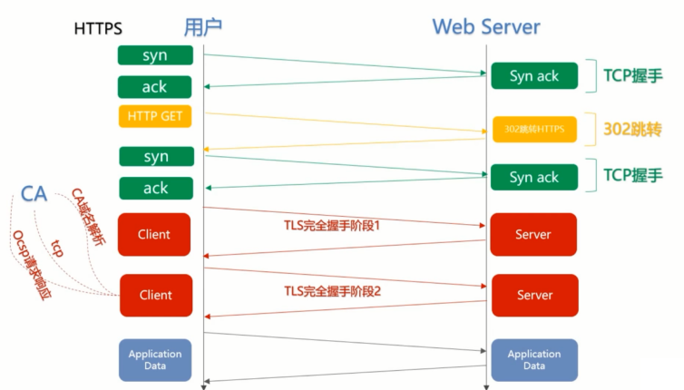

# HTTP 静相依 - 安全的 HTTPS

## 趣解 HTTP 与 HTTPS

HTTP

证书机构

## HTTPS 协议概述

- HTTPS 可以认为是 HTTP + TLS
- TLS 是传输层加密协议，它的前身是 SSL 协议。

- 内容加密
    - 非对称秘钥交换
    - 对称内容加密
- 身份认证
    - 数字证书
- 数据完整性

## HTTPS 使用成本

- 证书费用及更新维护
- HTTPS 降低用户访问速度
- 消耗 CPU 资源，需要增加大量机器

## HTTPS 对性能的影响

- 协议交互所增加的网络 RTT
- 加解密相关的计算耗时

### 网络耗时

### 计算耗时

- 浏览器计算耗时
- 服务器端计算耗时

## HTTPS 常见问题

- https 加密 是不是需要我在电脑上安装证书 / 保存密码？
- https 不就是在 http 后面加个 s，很难么？
- https 解决了所有劫持问题吗？
