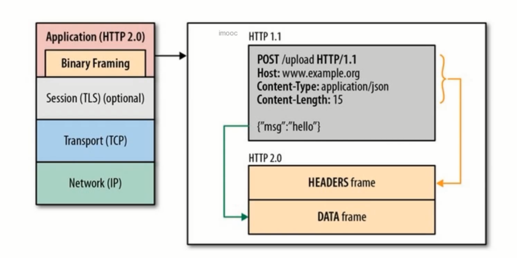

# HTTP 长相随 - 基于 HTTP 的功能追加协议

## HTTP 协议的瓶颈

影响 HTTP 网络请求的因素
- 带宽
- 延迟

HTTP 协议的瓶颈
- 一个连接上只可发送一个请求
- 请求只能能客户端开始。客户端不可以接受除响应以外的指令
- 请求 / 响应头部不经压缩就发送
- 每次互相发送相同的头部造成的浪费较多
- 非强制压缩发送

## 双工通信的 WebScocket

非持久化的 HTTP

WebScocket 的握手

### AJAX 轮训

### Long Poll

### 异常场景

### WebScocket

### WebScocket 的特点

- 真正的全双共方式
- 减少通信量
- 多路复用

## 探索式的实践 - SPDY

HTTP 的缺陷：
- 单路连接，请求低效
- HTTP 只允许由客户端主动发起请求
- HTTP 头部冗余

### SPDY 的改进

- 多路复用，请求优化
    
- 支持服务器推送技术
- SPDY 压缩了 HTTP 头
- 强制使用 SSL 传输协议

## 期盼已久的 HTTP2.0

HTTP 2.0 性能增强的核心：二进制分帧

HTTP2.0 首部压缩

HTTP2.0 多路复用

单链接多资源的优势：
- 可以减少服务器链接压力，内存占用少了，连接吞吐量大了
- 由于 TCP 连接减少而使网络拥塞状态得以改观
- 慢启动时间减少，拥塞和丢包回复速度更快

并行双向字节流的请求和响应：
- 并行交错地发送请求，请求之间互不影响
- 并行交错地发送响应，响应之间互不扰
- 只使用一个连接即可并行发送多个请求和响应
- 消除不必要的延迟，减少页面加载的时间

请求优先级：
- 高优先级的流都应该优先发送
- 优先级不是绝对的
- 不同优先级混合也是必须的

服务器推送

## 实验：HTTP1.1 升级 HTTP2.0 那些事

- 安装 apr
- 安装 apr-until
- 安装 openssl
- 安装 tomcat native
- 配置 ID
- 生成证书

## 管理 WEB 服务器文件的 WebDAV 协议

WebDAV （Web-based Distributed Authoring and Versioning） 一种基于 HTTP 1.1 协议的通信协议。它扩展了 HTTP 1.1，在 GET、POST、HEAD 等几个 HTTP 标准方法以外添加了一些新的方法，使应用程序可对 Web Server 直接读写，并支持写文件锁定(Locking)及解锁(Unlock)，还可以支持文件的版本控制。

WebDAV 新增状态码：

WebDAV 请求实例

## HTTP 的大跃进 - QUIC 与 HTTP3.0

HTTP2.0 的问题
- 对头阻塞
- 建立连接的握手延迟大

QUIC 的特性
- 0 RTT
    
- 没有对头阻塞的多路复用
    
- 前向纠错
    
