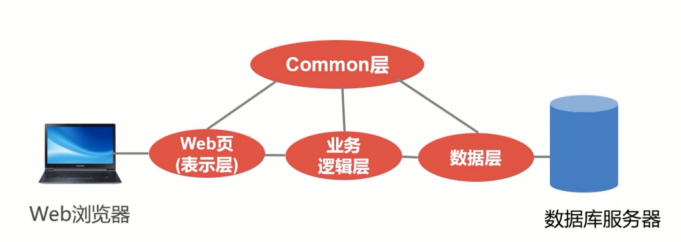
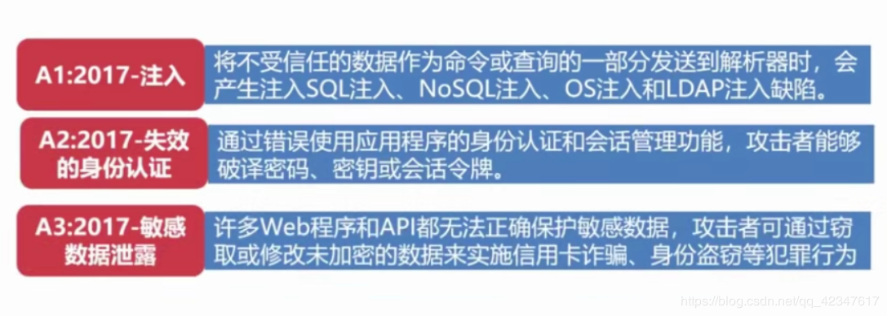
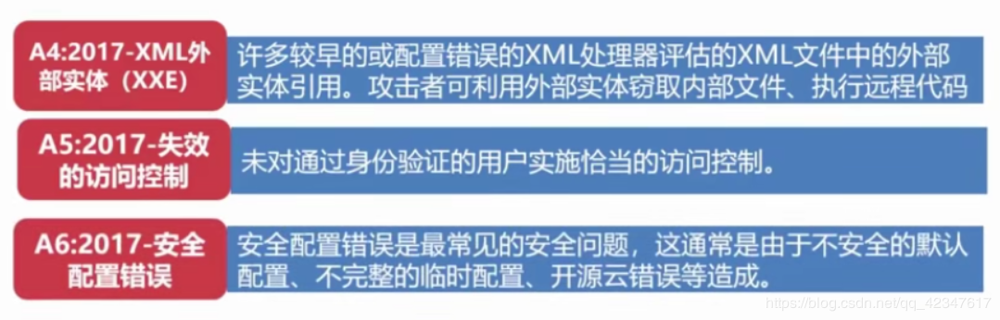
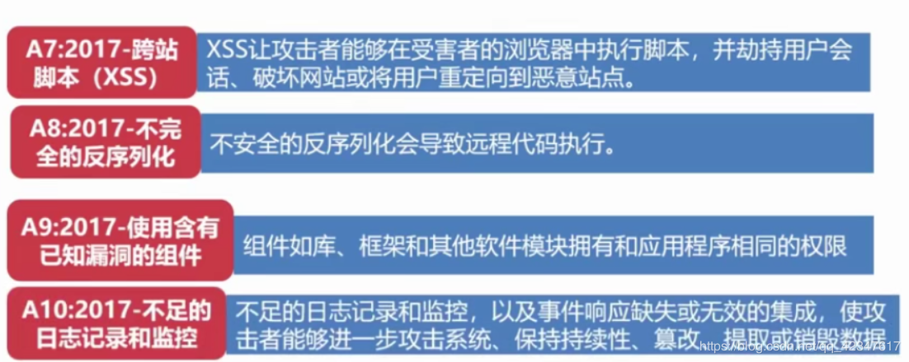
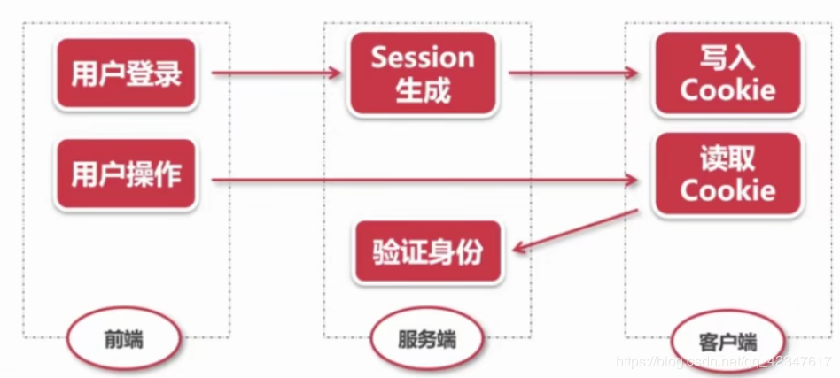
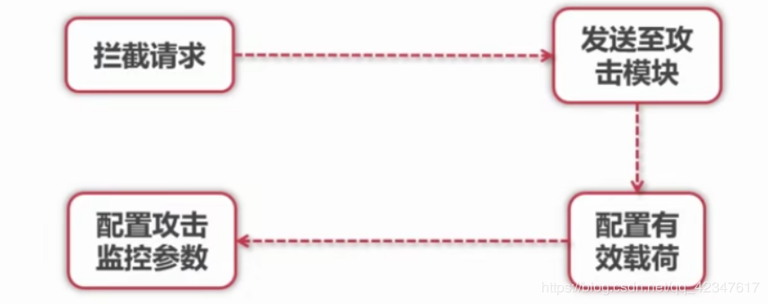
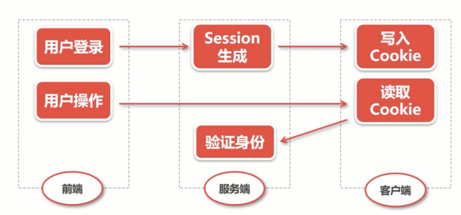

# HTTP 终相守 - Web 安全威胁解析

## Web 安全攻击概述

Web 应用的概念
- Web 应用是由动态脚本、编译过的代码等组合而成
- 它通常架设在 Web 服务器上吗，用户在 Web 浏览器上发送请求
- 这些请求使用 HTTP 协议，由Web应用和企业后台的数据库及其他动态内容通信

Web 应用三层架构
- 典型的 Web 应用通常是标准的三层架构模型



日常生活中的"安全"
- 为什么我们登陆的时候经常要求我们输入一个验证码？
- 在一个网站上长时间没有操作，为什么 session 会失效？

典型的安全模型
- 为什么北京地铁拥堵现象，容易发生安全问题？
- 如果是你，发挥天马行空的想象，有什么办法解决？

### WASC 的定义

Web Application Security Consortium（WASC），是一个由安全专家、行业顾问和诸多组织的代表组成的国际团体。WASC 组织的关键项目之一是"Web 安全威胁分类"，也就是将 Web 应用所受到的威胁、攻击进行说明并归纳成具有共同特征的分类。该项目的目的是针对 Web 应用的安全隐患，制定和推广行业标准术语。

### WASC 将 Web 应用安全威胁分为六大类

1. Authentication(验证)：用来确认某用户、服务或是应用身份的攻击手段。
1. Authorization(授权)：用来决定是否某用户、服务或是应用具有执行请求动作必要权限的攻击手段。
1. Client-Side Attacks(客户侧攻击):用来扰乱或是探测 Web 站点用户的攻击手段。
1. Command Execution(命令执行): 在 Web 站点上执行远程命令的攻击手段。
1. Information Disclosure(信息暴露):用来获取 Web 站点具体系统信息的攻击手段。
1. Logical Attacks(逻辑性攻击):用来扰乱或是探测 Web 应用逻辑流程的攻击手段。

### OWASP 的定义

Open Web Application Security Project(OWASP)，该组织致力于发现和解决不安全 Web 应用的根本原因。它们最重要的项目之一是"Web 应用的十大安全隐患"，总结了目前 Web 应用最常受到的十种攻击手段，并且按照攻击发生的概率进行了排序。这个项目的目的是统一业界最关键的 Web 应用安全隐患，并且加强企业对 Web 应用安全的意识。

了解更为详细的信息：www.owasp.org





## 验证机制安全

Web 应用程序最简单的一种安全机制。

防御恶意攻击的核心机制，也是最外层机制（入口的三层：验证机制 -> 会话管理（cookie， session） -> 访问控制（权限））

将 username, password 通过 POST 请求，传输到服务器端，由服务器端设计逻辑进行验证

典型的身份验证模式



### 验证技术

- 基于 HTML 表单验证
- 多元机制，如组合型密码
- 客户端 SSL 证书，如建行网盾U盘

#### HTML 表单验证

弱密码：
- 许多 Web 应用不对用户强度进行控制
    - 非常短或者空白密码
    - 以常用字典词汇为密码(password\123456)
    - 密码和用户名完全相同
    - 长时间使用默认密码

暴力破解：
- 暴力枚举用户名和密码
- 安全渗透工具：Burp Suite



常用的密码字典，大量发送登录请求，暴力枚举

### 验证码技术：

- 验证码是否真实有效
- 验证码复杂度（OC2 识别工具 =》 模糊图片，防止识别）
- 打码服务器 -> 分发给客户端打验证码 =》 点击型，滑动型，问答型

Cookie 和会话检测：
- 有些应用设置一个 cookie 中的参数 failedlogin = 0，登录失败后递增，达到上限后拒绝该用户
- 没用：cookie 在客户端，截取后将 failedlogin 修改，使其无法达到上限

双因子认证：

- 双重认证:
    - What you know （username, password）
    - What you have (phone)
    - 用户名，密码 + 验证码

- 登陆密码 + 交易密码

忘记密码模块的漏洞：谁忘记了你的密码
    - 安全问题 （被明文传输）
    - 邮箱，手机号 （更改 HTTP 的 GET 请求中的邮箱，手机号重定向）

MD5 加密依赖
- 不可逆，非对称加密：无法 decode ， 只能 encode
- 彩虹表：用大数据库中存储所有 MD5 加密的明文和密文

多阶登录机制
- 传统观念：信息越多，越安全
- 实际上：阶段越多，漏洞可能的越多
- Point 1: 应用程序可能会任务访问到第三阶段的用户已经完成前两个阶段的验证
- Point 2: 可能认为每个阶段用户身份不会发生变化
- Point 3：随机选择问题 保存在隐藏的 HTML 表单中（或问题太简单）


## 会话管理机制

登录功能的重要安全组件，保证用户的真实性

攻破管理用户，可以控制整个应用程序

会话令牌：Cookie
- 一些会话令牌：通过用户名或其他信息转换而来，或简单的加密，模糊处理，容易被 decode
- 攻击者可以生成大量可能有效的令牌，实施攻击

令牌可预测：
- 隐含序列
- 时间依赖

会话令牌生成漏洞：
- 生成随机数强度不足（伪随机数）

会话终止攻击:
- 会话终止攻击：手动终止会话防止安全问题
- 有些应用程序，不提供终止会话功能，并未真正在服务端删除令牌

会话劫持攻击：（目前最多）
- 攻击者通过网络嗅探，XSS 攻击等方式获取被攻击者会话令牌



### 会话管理漏洞的防御

1. 令牌传输安全：
    - 采用 HTTPS 传送令牌
    - 用 HTTP cookie 传送令牌时，应标记为 secure，以防止浏览器用 HTTP 传送它们

2. 增加软硬会话过期
    - 软会话过期：用户一段时间无交互，自动 Session 失效
    - 硬会话过期：时间到了，强制终止会话（以前一些银行…会用）

3. 提供完善的注销功能：
    - Logout
    - 【注】要保证注销不存在会话终止漏洞

## SQL 注入攻击

几乎每个 Web 应用都需要使用数据库，Web 应用经常会建立用户提交数据的 SQL 语句

如果建立这种语句的方法不够安全，就很容易收到 SQL 注入

攻击者，可利用 SQL 注入读取甚至修改数据库中的数据

用户提交一段数据库查询代码，获取程序返回的结果

拼接 SQL 语句：
```sql
SELECT COUNT(*)
FROM user
WHERE username = '' or 1=1 AND password = …
```

SQL 注入危害：
1. 探知数据库的具体结构来进行攻击，SQL 盲注
2. 泄漏数据: 账户信息
3. 取得更高权限，来修改表数据甚至内部结构

防御方法：
- 参数化查询：（根本性防御策略），预处理语句
    - 先指定查询结构，用户输入预留占位符
    - 再指定占位符内容（隔离开业务语句和用户输入）

## 跨站脚本攻击

攻击者将恶意的 JS 等脚本代码，植入到用户使用的页面中，用户观看网页，恶意脚本就会自动执行

通常通过注入 HTML 或 JS 等脚本来发动攻击

攻击成功后，攻击者可以得到私密网页内容和 cookie（会话令牌）等

XSS 攻击危害
- 盗取各类用户的账号
- 控制数据
- 盗取商业资料
- 非法转账
- 强制发送网站挂马
- 控制受害者机器向其他网站发起攻击

### XSS 分类

1. 反射式 XSS
    - 非永久性 XSS，出现在服务器直接使用客户端提交的数据，如 URL 数据，HTML 表单中提交数据等, 并且没有对数据进行无害化处理
    - 如果提交的数据中含有 HTML 控制字符没有被正确处理，XSS 就发生了

2. 存储式 XSS
    - 危害更大，但易被清除
    - 浏览信息的用户会被盗取会话 cookie 或其他信息

3. 基于 DOM 的 XSS 攻击
    - 反射式 XSS 和 存储式 XSS 都是通过服务器端提取用户提交的数据
    - 基于 DOM 的 XSS 仅通过前端通过动态 JS 执行

### XSS 攻击载荷

载荷：可能攻击的位置

会话令牌
- 最常用的攻击方式：截取会话令牌，劫持他的会话，然后冒充它

虚拟置换
- 注入恶意数据，例如 HTML，诱导用户进入钓鱼网址等

注入木马
- 注入登录表单：攻击者注入的功能向用户显示一个木马登录表单，要求他们向攻击者控制的服务器提交他们自己的证书

XSS 防御措施
1. 输入验证
2. 输出编码（净化可能遇到的恶意字符，将 response 的内容编码，例如将’, "等字符编码）

## CSRF 攻击

跨站请求伪造 CSRF （Cross-site Request Forgery）,又叫 one click attack 或者 session riding ， 是一种对网站的恶意利用

XSS 利用站点内的信任用户,而 CSRF 通过伪装来自受信任用户的请求来利用受信任的网站

例如：发邮件骗用户改密码，转账…

不太流行：沉睡的巨人！

原理：
1. Web 浏览器对于 Cookie 和 HTTP 身份验证信息之类的会话信息处理方式：一般情况下，浏览器收到站点设置的 Cookie 之后，每当该站点发送请求的时候，浏览器都会"自动地"连同该 Cookie 一起发出
2. 应用程序赖以管理会话的信息对浏览器的透明性问题：

CSRF 攻击预防
1. 增加确认操作
1. 重新认证：重新输入密码（二次认证，用户繁琐）
1. 使用 Token（登录时服务器端在用户 session 中产生随机 Token，每次请求比对 Token 是否一致）
